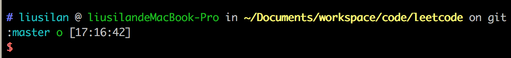
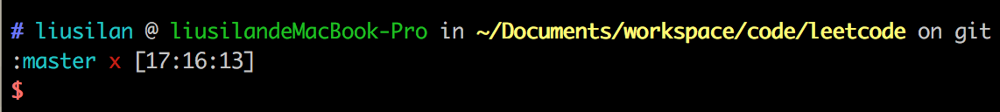
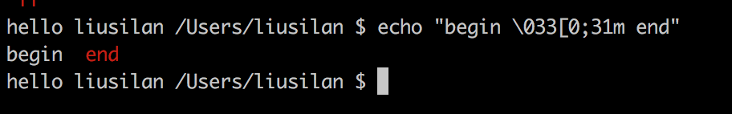
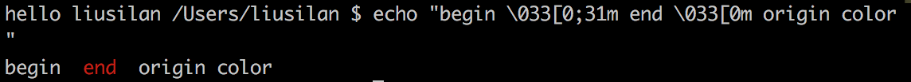

@(ios)

### Terminal如何自定义提示

当我们打开终端时，在输入命令的位置之前，会有一段字符，显示当前用户、主机名等信息。

有的同学可能使用zshell，它功能更丰富，并且可以选择主题。不同的主题前面那段字符是不一样的。比如我主题用的是`ys`，显示效果如下。从左至右依次是：`# 用户名 @ 主机名 in 当前路径 (如果是git仓库，会显示当前分支，是否是clean状态) 当前时间`




那么这些提示是如何进行设置的呢？今天刚好看到[这篇文章](https://marcpalmer.net/hacking-my-shell-prompt-so-i-make-less-mistakes-working-with-xcode-projects/?utm_campaign=iOS%2BDev%2BWeekly&utm_medium=email&utm_source=iOS%2BDev%2BWeekly%2BIssue%2B354)，记录一下。

#### 如何自定义

其实核心就一句。

```
export PS1="hello world "
```

后面跟上你想显示的字符串就可以。如果使用`bash`，将这句加上`~/.bash_profile`最后；如果是`zshell`，则加到`~/.zshrc`中，然后重启终端。

添加之后的效果如下：


如果想要显示用户名，当前路径，可以这样设置，顺便加个$结尾，以便与敲入的命令分隔。

```
export PS1="hello $USER `pwd` $ "
```

效果如图：


#### 设置颜色

从图1可以看出，zshell提示的颜色可谓是多种多样。那么颜色该如何设置呢。

google一下，发现要让shell的输出显示颜色，只需要带上颜色字符即可。

比如`\033[0;31m`代表红色。如果在终端中敲入：`echo "begin \033[0;31m end"`，`end`会显示为红色，begin还是原本设置的原色，就简称为`本色`吧。效果如下：




如果想让end后面的字符显示`本色`，在`end`后面跟上`Reset Color`，对应下表中的`'\033[0m'`。



完整颜色表如下：

```
# Reset
Color_Off='\033[0m'       # Text Reset

# Regular Colors
Black='\033[0;30m'        # Black
Red='\033[0;31m'          # Red
Green='\033[0;32m'        # Green
Yellow='\033[0;33m'       # Yellow
Blue='\033[0;34m'         # Blue
Purple='\033[0;35m'       # Purple
Cyan='\033[0;36m'         # Cyan
White='\033[0;37m'        # White

# Bold
BBlack='\033[1;30m'       # Black
BRed='\033[1;31m'         # Red
BGreen='\033[1;32m'       # Green
BYellow='\033[1;33m'      # Yellow
BBlue='\033[1;34m'        # Blue
BPurple='\033[1;35m'      # Purple
BCyan='\033[1;36m'        # Cyan
BWhite='\033[1;37m'       # White

# High Intensity
IBlack='\033[0;90m'       # Black
IRed='\033[0;91m'         # Red
IGreen='\033[0;92m'       # Green
IYellow='\033[0;93m'      # Yellow
IBlue='\033[0;94m'        # Blue
IPurple='\033[0;95m'      # Purple
ICyan='\033[0;96m'        # Cyan
IWhite='\033[0;97m'       # White

# Bold High Intensity
BIBlack='\033[1;90m'      # Black
BIRed='\033[1;91m'        # Red
BIGreen='\033[1;92m'      # Green
BIYellow='\033[1;93m'     # Yellow
BIBlue='\033[1;94m'       # Blue
BIPurple='\033[1;95m'     # Purple
BICyan='\033[1;96m'       # Cyan
BIWhite='\033[1;97m'      # White

# High Intensity backgrounds
On_IBlack='\033[0;100m'   # Black
On_IRed='\033[0;101m'     # Red
On_IGreen='\033[0;102m'   # Green
On_IYellow='\033[0;103m'  # Yellow
On_IBlue='\033[0;104m'    # Blue
On_IPurple='\033[0;105m'  # Purple
On_ICyan='\033[0;106m'    # Cyan
On_IWhite='\033[0;107m'   # White
```


同样可以在.bash_profile/~/.zshrc中设置提示的颜色。

如下让用户名为绿色，路径为红色：

```
export PS1="hello `echo '\033[0;32m'` $USER `echo '\033[0;31m'` `pwd` $ "
```


此时`$`也是红色的，若要设置成本色，可添加`reset color`。

另外，在[这篇文章](https://marcpalmer.net/hacking-my-shell-prompt-so-i-make-less-mistakes-working-with-xcode-projects/?utm_campaign=iOS%2BDev%2BWeekly&utm_medium=email&utm_source=iOS%2BDev%2BWeekly%2BIssue%2B354) 中，提到了如何显示当前xcode版本，git分支，git status的实现，有兴趣可以看看。

参考链接：

* [Hacking my shell prompt so I make fewer mistakes working with Xcode projects](https://marcpalmer.net/hacking-my-shell-prompt-so-i-make-less-mistakes-working-with-xcode-projects/?utm_campaign=iOS%2BDev%2BWeekly&utm_medium=email&utm_source=iOS%2BDev%2BWeekly%2BIssue%2B354) 

* [How to change the output color of echo in Linux
](https://stackoverflow.com/questions/5947742/how-to-change-the-output-color-of-echo-in-linux?utm_medium=organic&utm_source=google_rich_qa&utm_campaign=google_rich_qa)


