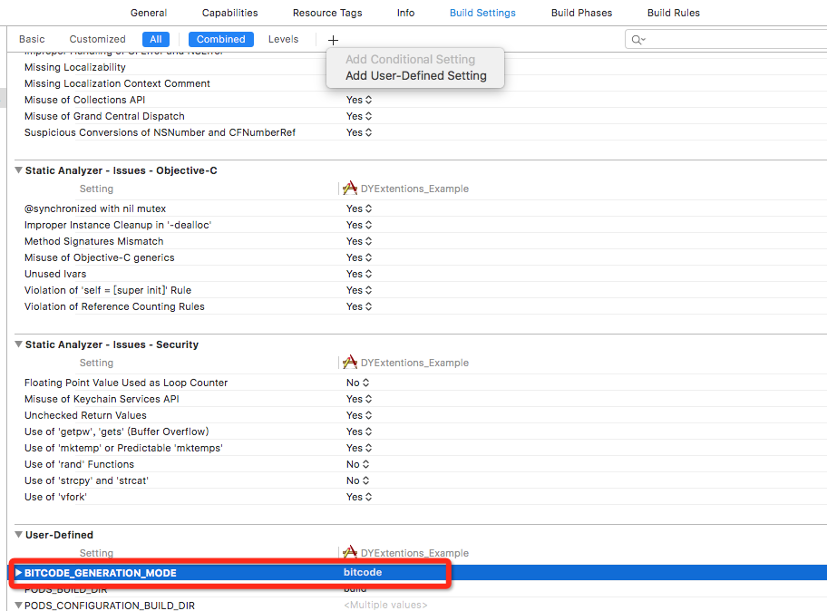
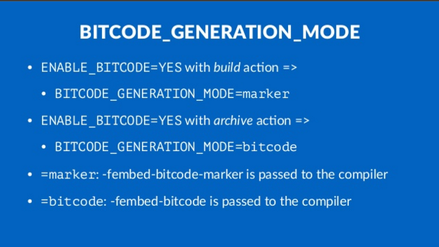
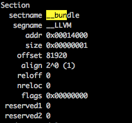

最近，在将工程中的几个基础库打包成动态库，减少二进制包大小。在本机build时没出现啥问题。但是在jenkins上打包，却出现了如下错误：

```
Error Domain=IDEFoundationErrorDomain Code=1 "Failed to verify bitcode in FLAnimatedImage.framework/FLAnimatedImage:
error: Bundle only contains bitcode-marker 
```

经搜索，发现跟bitcode相关。因为这些库默认是支持bitcode的，在build时，compile的参数是`-fembed-bitcode-marker`，它只是标记二进制文件中有bitcode，但是实际上没有内容，一般用于测试。

而我们在jenkins上打包时，先archive，然后再导出ipa包，而archive的编译参数是`-fembed-bitcode`，所以与本地调试不太一样。

那么，这两个参数有什么区别呢？

[StackOverFlow上的回答](https://stackoverflow.com/questions/31233395/ios-library-to-bitcode)说的比较清楚。

> 
•	-fembed-bitcode-marker simply marks where the bitcode would be in the binary after an archive build.
•	-fembed-bitcode actually does the full bitcode generation and embedding, so this is what you need to use for building static libraries.
•	Xcode itself builds with -fembed-bitcode-marker for regular builds (like deploy to simulator)
•	Xcode only builds with -fembed-bitcode for archive builds / production builds (as this is only needed for Apple).


`-fembed-bitcode-marker`会生成一个最小bitcode的section，但是没有任何内容，size=1。
`-fembed-bitcode`则会生成bitcode的相关内容。

> 
You should be aware that a normal build with the -fembed-bitcode-marker option will produce minimal size embedded bitcode sections without any real content. This is done as a way of testing the bitcode-related aspects of your build without slowing down the build process. The actual bitcode content is included when you do an Archive build.

所以我们在打包lib的时候，需要设置参数`-fembed-bitcode`，这样才会包含bitcode的内容。

因此，解决方案有两种：

* 禁用bitcode
* 设置参数`-fembed-bitcode`

### 如何设置参数

由于我是基于pod package来打包，所以需要需改podspec文件，添加xcconfig即可。

```
s.xcconfig = {'BITCODE_GENERATION_MODE' => 'bitcode'}
```

这里插一句，在用pod package打包时，如果依赖的库是动态库时，会有问题，我自己将源码改了下，会另外写一篇文章说说。

如果你是通过xcodebuild来打包lib的话，可以在build setting的User-Define Setting中添加，这样在build的时候也会是`-fembed-bitcode`。

```
'BITCODE_GENERATION_MODE' => 'bitcode'
```

如下图：


如果想让参数是`-fembed-bitcode-marker`，设置为marker

```
'BITCODE_GENERATION_MODE' => 'marker'
```

这张图表达的比较清晰：



另外还有一个种方式是直接在Other C flags里设置，网上说会产生warning。不过我还没尝试过。推荐使用设置BITCODE_GENERATION_MODE的方式。

> (When I tested using the -fembed-bitcode on the Other C flags, Xcode gave the warning clang: warning: argument unused during compilation: '-fembed-bitcode-marker')

### 如何检查生成的lib是否正确

可通过以下方式查看，打出的lib参数是`-fembed-bitcode-marker`还是`-fembed-bitcode`。

在terminal中输入

```
otool -arch armv7 -l xx.a/xx.framework
```

`注意：如果lib包含了模拟器架构，则需要指定相应真机的arch才能看得到。`

然后，Ctrl+F，搜索__bundle，应该会出现以下内容：

```
Section
  sectname __bundle
   segname __LLVM
      addr 0x0002c000
      size 0x000b0a09
    offset 180224
     align 2^0 (1)
    reloff 0
    nreloc 0
     flags 0x00000000
 reserved1 0
 reserved2 0
```

如果size不为1，则说明是`-fembed-bitcode`。

如果结果如下图，则是`-fembed-bitcode-marker`，说明我们打的包不对。



另外，如果要查看lib是否支持bitcode，可执行如下命令，查看是否有`__LLVM`。

```
otool -arch armv7 -l xx.a/xx.framework | grep __LLVM
```


