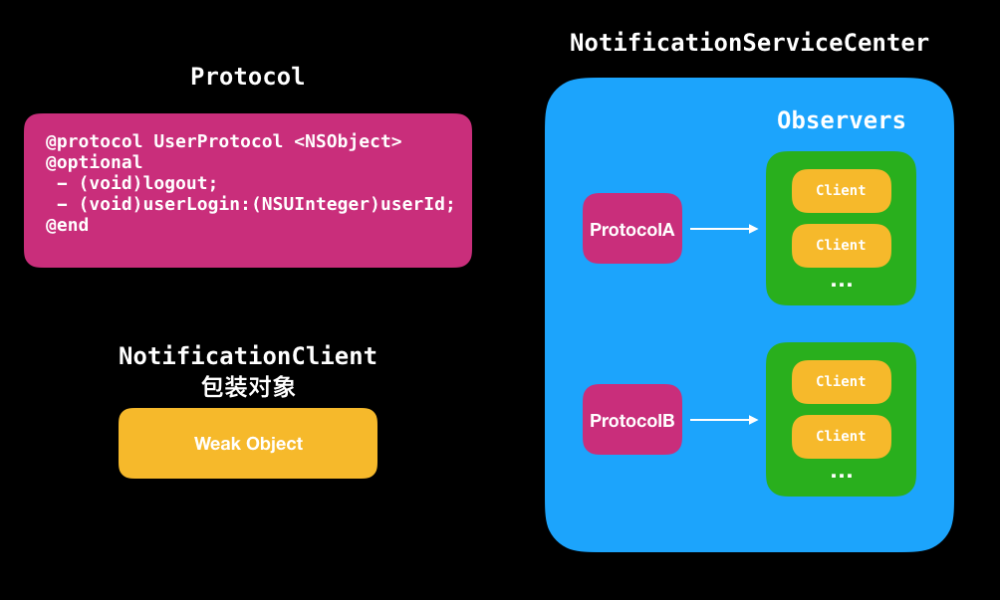

# iOS中消息通知的另一种方式

## 原理
iOS中消息通知是以notificationName来做为标识，发通知时，监听了同一个notificationName的实例会收到通知。

而这里所说的方式是以protocol为标识，发通知时，以protocol+selector，来判断要发送给哪些实例。

做法如下：

1. 将需要通知的方法定义成protocol，通常是将一组有关联的方法定义在同个protocol中。

2. 以protocol为key，监听该protocol的实例（可能有多个）为value，组成映射关系，即protocol->observer list。

3. 防止强引用实例，使用包装对象，用weak属性存储该实例。

4. 发送通知时，根据protocol+selector，拿到对应的实例，进行调用，同时传递参数。

看图会比较清晰：



相比自带的消息通知，好处是：

* 自带的消息通知，添加同一个notificationName多次，会收到多个通知，而这种方式会去重。
* 参数灵活，可直接传递，不用包装成dict和解dict。
* 避免移除系统通知的问题
* 实例对象以weak修饰，其释放后，会自动置为nil。避免野指针问题。

### 添加观察者

```
// 可在内部判断该protocol对应的object是否重复添加
#define ADD_SERVICE_CLIENT(protocolName, object) 
[[NotificationServiceCenter defaultCenter] addServiceClient:object withKey:@protocol(protocolName)]
```

添加时，需带上要监听的protocol。

### 发送通知

```
#define NOTIFY_SERVICE_CLIENT(protocolName, selector, func) \
{ \
NSArray *__clients__ = [[NotificationServiceCenter defaultCenter] serviceClientsWithKey:@protocol(protocolName)]; \
for (NotificationClient *client in __clients__) \
{ \
id obj = client.object; \
if ([obj respondsToSelector:selector]) \
{ \
[obj func]; \
} \
} \

```

发送时需要加上selector和func。selector用来判断实例是否实现了该selector，func用来直接调用方法。

```
if ([obj respondsToSelector:selector])
{ 
	[obj func]; 
} 
```

Example:

```   
NOTIFY_SERVICE_CLIENT(UserProtocol, @selector(userLogin:), userLogin:19000);
```

有个比较巧妙的地方，就是方法的调用和参数的传递。使用宏替换的特性，直接写成[obj func]，在编译时不会报错。比如上面的例子中，func指userLogin:19000，展开调用就是[obj userLogin:900]。如果我们要将NOTIFY_SERVICE_CLIENT写成方法，是会编译不过的，因为这里的func根本就不是一种类型。所以采用宏，比较tricky的解决这个问题。

另外，如果在处理通知过程中，又调用NOTIFY_SERVICE_CLIENT给同一个protocol+selector发送通知消息，是会引起死循环的。

比如A监听了ProtocolA的test方法，在test方法中调用NOTIFY_SERVICE_CLIENT(ProtocolA, @selector(test), test)，A又会收到通知，循环往复，就会造成死循环。所以，需要注意这种情况。

```
// 在A中
- (void)addClient {
     ADD_SERVICE_CLIENT(ProtocolA, self)
}

#pragma mark - ProtocolA

// 收到通知
- (void)test {
    NSLog("receive ProtocolA test");
    
    // 会引起死循环
    NOTIFY_SERVICE_CLIENT(ProtocolA, @selector(test), test)
}

```

### 移除观察者

```
#define REMOVE_SERVICE_CLIENT(protocolName, object) 
[[NotificationServiceCenter defaultCenter] removeServiceClient:object withKey:@protocol(protocolName)]

#define REMOVE_ALL_SERVICE_CLIENT(object) 
[[NotificationServiceCenter defaultCenter] removeServiceClient:object]
```

移除有两种方式：移除单个protocol和移除该object监听的所有protocol。


## 使用

定义protocol

```
@protocol UserProtocol <NSObject>

@optional
- (void)logout;

- (void)userLogin:(NSUInteger)userID;

@end
```

添加监听，实现通知的方法，移除监听。注意需让其**遵循协议**，因为在ADD_SERVICE_CLIENT会判断object是否遵循了protocol。

```
@interface ViewController ()<UserProtocol>

@end

- (void)viewDidLoad {
    [super viewDidLoad];
    // Do any additional setup after loading the view, typically from a nib.
		
	// 添加监听    
    ADD_SERVICE_CLIENT(UserProtocol, self);
}

- (void)dealloc {
	// 移除监听
    REMOVE_ALL_SERVICE_CLIENT(self);
}

#pragma mark - UserProtocol

// 通知过来后的具体实现
- (void)logout {
    NSLog(@"logout");
}

- (void)userLogin:(NSUInteger)userId {
    NSLog(@"loginSuccess");
}

```

发送通知：

```
- (IBAction)login:(id)sender {
    NOTIFY_SERVICE_CLIENT(UserProtocol, @selector(userLogin:), userLogin:19000);
}

- (IBAction)logout:(id)sender {
    NOTIFY_SERVICE_CLIENT(UserProtocol, @selector(logout), logout);
}
```

如果只关心protocol的某个方法通知，只需要实现该方法即可，不需要实现protocol中的所有方法。


