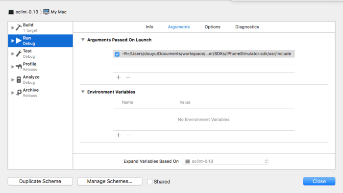
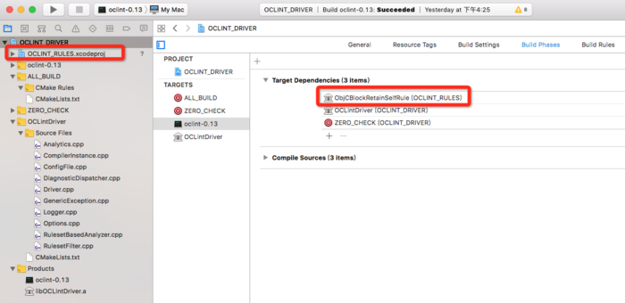
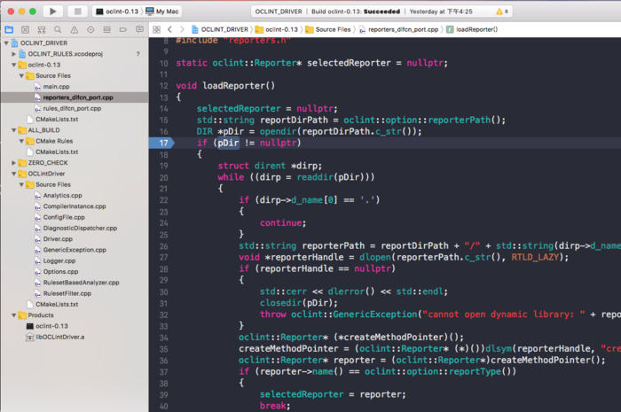
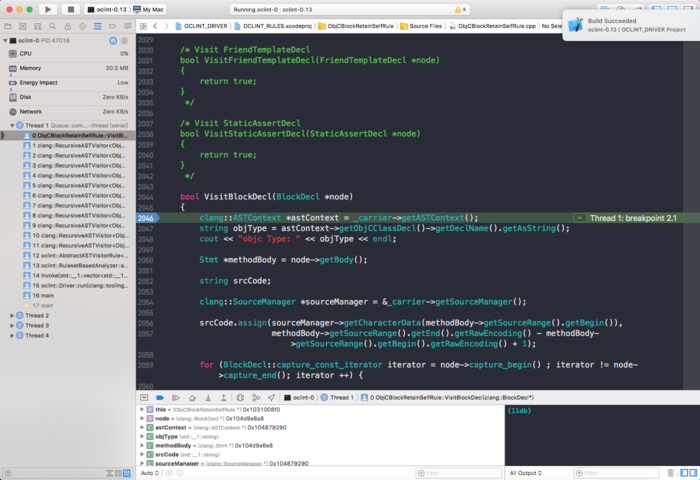

### OCLint自定义规则的调试

oclint自定义规则的编写，一般我们会生成xcode工程，然后进行编码，build之后会输出dylib。如果我们要验证规则的正确性，只能把dylib拷贝到rules的目录中，然后在进行测试。这样实在是很麻烦，也只能通过log来输出信息，然而clang的方法那么多，log方式也不便于调试。于是在想如何在XCode中进行调试。但我搜索了很多，尝试一直都不行。

这里有一个方案：[OCLint自定义规则的调试方法](http://blog.csdn.net/hdwhappy/article/details/78486564)，但是不知道他的oclintexe是怎么写的，我自己尝试新建Command Line Tool的工程，然后用NSTask调起oclint的命令，还是没能断点到，可能是我的实现有问题。

后来又发现了一个答案，[How to launch OCLint in xcode with debug model.](https://github.com/oclint/oclint/issues/447#issuecomment-350166378)，也是讨论如何在xcode中进行调试的。一开始没明白答案中步骤的意思，一直无果，突然有一天开窍了。
`used the cmake tool, create xcode project with each module`，看到了`each module`。然后就想到，在创建rule的时候，不也是通过以下cmake命令生成的xcode工程，LLVM_ROOT指向的是oclint-rules。


```
#! /bin/sh -e

cmake -G Xcode \
    -D CMAKE_CXX_COMPILER=../build/llvm-install/bin/clang++  \
    -D CMAKE_C_COMPILER=../build/llvm-install/bin/clang \
    -D OCLINT_BUILD_DIR=../build/oclint-core \
    -D OCLINT_SOURCE_DIR=../oclint-core \
    -D OCLINT_METRICS_SOURCE_DIR=../oclint-metrics \
    -D OCLINT_METRICS_BUILD_DIR=../build/oclint-metrics \
    -D LLVM_ROOT=../build/llvm-install/ ../oclint-rules
```

后来发现oclint目录下还有好几个文件夹，oclint-core，oclint-driver，oclint-metrics，oclint-reporters，countly等，是都可以生成xcode工程的。然后，按照步骤，一个个生成了xcode工程，然后进行编译。发现oclint-driver这个工程是可以直接跑起oclint的，大喜。

不过最终也不需要答案中的那么复杂，只需要生成oclint-driver的xcode工程编译即可。

下面来具体说下调试的步骤。

### 调试步骤

如果有不清楚oclint如何编写自定义规则的，请看这里：[Code Review-OCLint系列开篇](http://oriochan.com/codeReview01.html)

写的比较详细，一步步操作下来就好。不过在编译源码之前，需要安装好所需的环境。两个命令就好。

```
brew install subversion git cmake lcov openssl
brew install ninja
```

(1) 首先生成oclint-xcoderules的xcode工程。按上面的教程来。
(2) 生成oclint-driver的xcode工程，只需把脚本改成LLVM_ROOT = oclint_drivers的目录。

```
cd oclint
mkdir oclint-xcodedriver
cd oclint-xcodedriver
touch create.sh
chmod +x create.sh
```

create.sh脚本内容如下：

```
#! /bin/sh -e

cmake -G Xcode \
    -D CMAKE_CXX_COMPILER=../build/llvm-install/bin/clang++  \
    -D CMAKE_C_COMPILER=../build/llvm-install/bin/clang \
    -D OCLINT_BUILD_DIR=../build/oclint-core \
    -D OCLINT_SOURCE_DIR=../oclint-core \
    -D OCLINT_METRICS_SOURCE_DIR=../oclint-metrics \
    -D OCLINT_METRICS_BUILD_DIR=../build/oclint-metrics \
    -D LLVM_ROOT=../build/llvm-install/ ../oclint_drivers
```
最后执行./create.sh，即可生成oclint-driver的xcode工程。

(3)但是在xcode中编译oclint-driver的时候，我这边出现了报错问题。如果你也碰到同样的问题，可以这样解决。

* 在编译OCLintDriver.a库的时候，报错。`<countly/Countly.h>`找不到。是因为Header Search Paths没配置countly头文件的路径。

	切到OCLintDriver target的build setting--->Header Search Paths，添加`/Users/liusilan/Documents/workspace/my/opensource/oclint/countly/include`，这里改成自己的路径。

* 在编译oclint-0.13的target时，出现`-lcountly`找不到的情况。这是因为Library path没有配置countly的路径。

	同样在build settings->Library Search Paths，添加lib路径。`/Users/liusilan/Documents/workspace/my/opensource/oclint/build/countly/lib`，这里改成自己的路径。

	然后build，就可以成功的跑起oclint了。

(4) 由于我们需要调试自定义规则，就需要在刚能跑起来的oclint中调起规则，oclint有个参数-R，代表rule的文件夹路径。通过Arguments Passed On Lanunch的方式，可以添加参数。rule的dylib的输出路径是
```
/Users/liusilan/Documents/workspace/my/opensource/oclint/oclint-xcoderules/rules.dl/Debug
```

把这个参数传进去就可以。然后再添加需要检查的文件，输出格式，系统文件路径等。
 
 

总的参数如下：
```
-R=/Users/liusilan/Documents/workspace/my/opensource/oclint/oclint-xcoderules/rules.dl/Debug -report-type html -o /Users/liusilan/Documents/workspace/my/demo/Demo/reporter.html /Users/liusilan/Documents/workspace/my/demo/Demo/Demo/Test.m -- -x objective-c -isystem /Users/liusilan/Documents/workspace/my/opensource/oclint/build/oclint-release/lib/clang/5.0.0/include -iframework /Applications/Xcode.app/Contents/Developer/Platforms/iPhoneSimulator.platform/Developer/SDKs/iPhoneSimulator.sdk/System/Library/Frameworks -isystem /Applications/Xcode.app/Contents/Developer/Platforms/iPhoneSimulator.platform/Developer/SDKs/iPhoneSimulator.sdk/usr/include
```

注意：如果出现`'stdarg.h' file not found`的报错，则需要添加clang的头文件路径。

```
-isystem /Users/liusilan/Documents/workspace/my/opensource/oclint/build/oclint-release/lib/clang/5.0.0/include
```

(5)这种方式需要自定义的规则先生成好。但每次改动了，都要去oclint-rule的工程中去跑一遍，稍显麻烦。可以直接把oclint-rule的xcode工程作为oclint-driver的子工程，然后设置target依赖于你要调试的rule的target即可。这样，在跑oclint的时候，就会先编译好自定义的规则了。


(6)一切都配置好之后，在自定义规则里打好断点，run起来，又出现了一个问题😯，`cannot find dynamic library for report type:html`。在工程中搜索了下，发现是在某个木下找不到对应report libray。于是，断点在这。看reportDirPath是指向的哪个路径。结果是
```
"/Users/liusilan/Documents/workspace/my/opensource/oclint/oclint-xcode-driver/bin/Debug/../lib/oclint/reporters"
```

的确这个路径下是没有libHTMLReporter.dylib，为了方便，索性直接将整个reporters
`/Users/liusilan/Documents/workspace/my/opensource/oclint/build/oclint-reporters/reporters.dl`拷贝到了上面的路径。




最后，一切都顺利了，成功调试。



